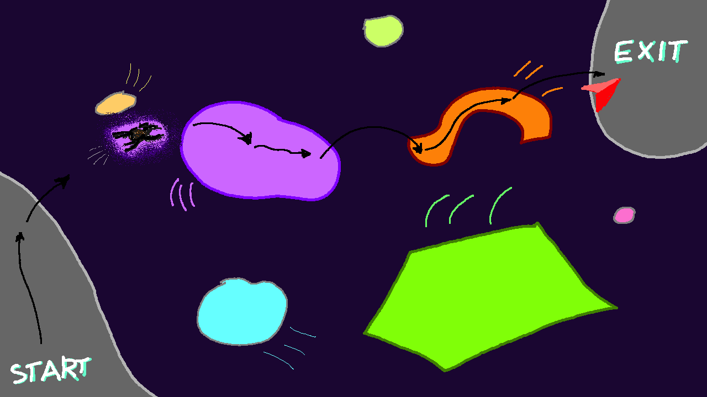

= Game concept

== Description

You are a spider trapped in a weird dimension. Naturally, you want to escape this wretched place. But for that you need to find the exit first! Luckily you have your spidey senses that point towards the direction of exit. Jump from one moving shape to another marching towards freedom. Be careful to not fall into the void!

.Shape Hopper concept art
[align=center]

== Mechanics

Player controls a spider in a top view 2D world. The spider can run forward, walk backwards, rotate left and right and most importantly, jump.

The goal of the game is to get to level exit by jumping from one platform to the next. The exit is usually not visible to the player at the beginning of the level. The spider posesses a "spidey sense" - it always knows the direction of the level exit. This is indicated by the arrow on the screen.

The spider can only jump so far. In addition to that the platforms usually have linear and rotational momentum both of which translate to the spider. In any case, it's important to gauge your jumps carefully.

The game consists of multiple levels with increasing difficulty, reflected in faster moving platforms, trickier shapes (less convex) and larger distance to cross to the end.